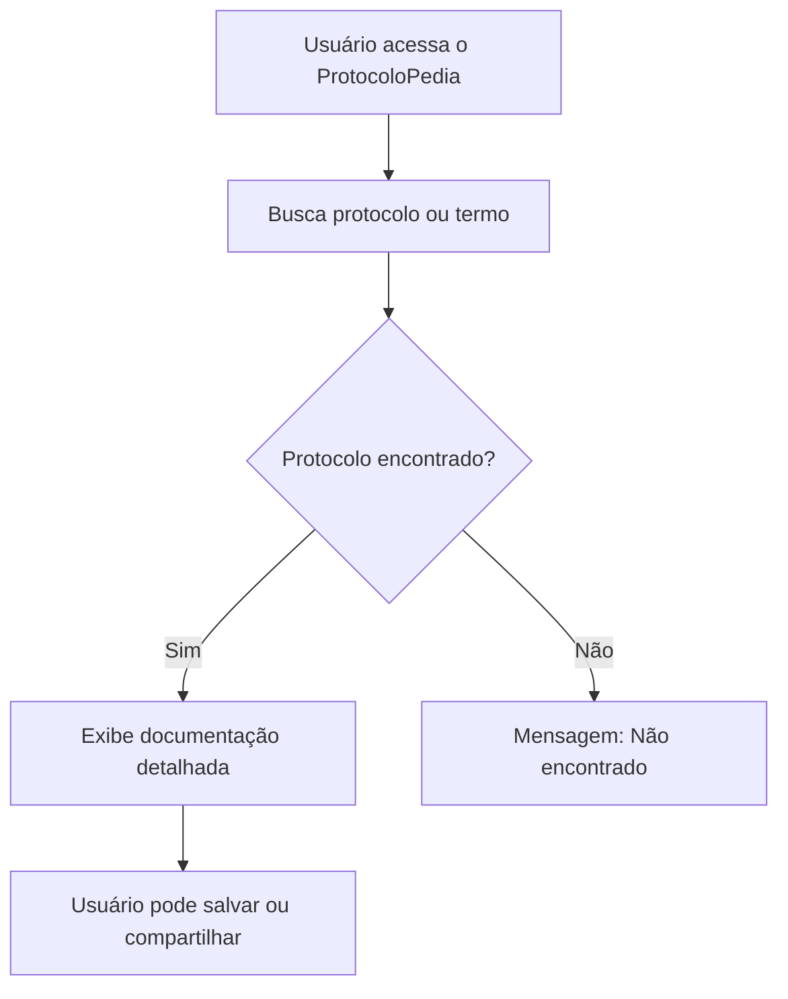
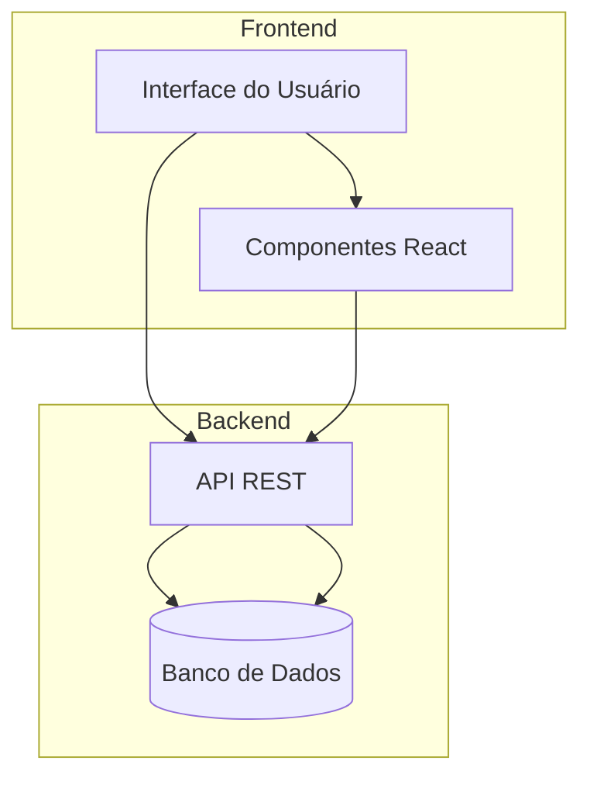
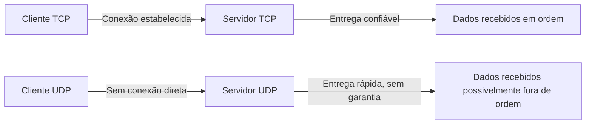
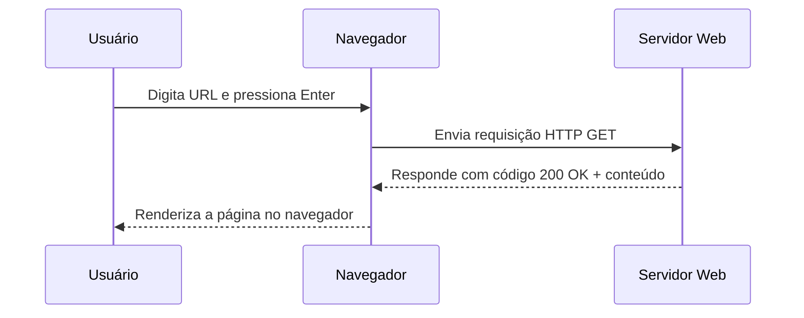
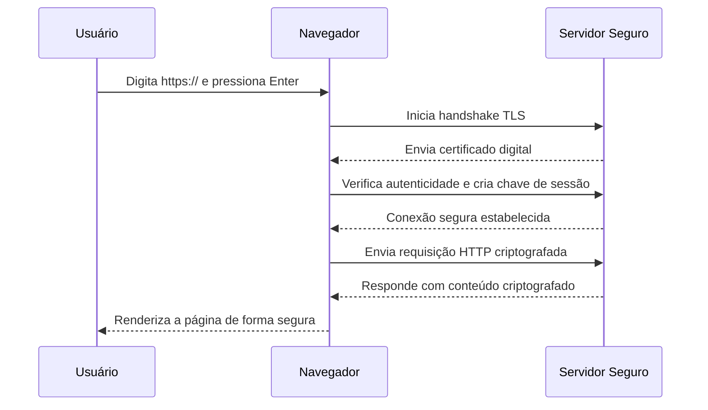

# 📘 ProtocoloPedia

O **ProtocoloPedia** é uma plataforma interativa voltada para o estudo, consulta e documentação de protocolos de comunicação e redes.  
A proposta é oferecer uma forma clara e organizada de visualizar informações técnicas, fluxos de comunicação e conceitos de redes.  

---

## 🚀 Funcionalidades

- 📑 **Documentação organizada** por tópicos de protocolos.  
- 🔍 **Busca rápida** por termos e conceitos.  
- 📊 **Diagramas explicativos** em tempo real (usando Mermaid).  
- 🖥️ **Interface limpa e responsiva**.  

---

## 📂 Estrutura do Projeto

```bash
ProtocoloPedia/
│── assets/          # Imagens, ícones e arquivos estáticos
│── src/             # Código-fonte principal
│   ├── components/  # Componentes reutilizáveis
│   ├── pages/       # Páginas principais do sistema
│   └── utils/       # Funções auxiliares
│── README.md        # Documentação do projeto
│── package.json     # Dependências e scripts

## 🛠️ Tecnologias Utilizadas
 HTML5 / CSS3 / JavaScript

 Framework Frontend (React ou similar)

 TailwindCSS para estilização moderna

 Mermaid.js para geração de diagramas

## 📊 Diagramas (Mermaid)
    1. Fluxo de Usuário


## 2. Estrutura de Páginas
 ``` mermaid

graph LR
    Home[🏠 Página Inicial] --> Search[🔍 Busca de Protocolos]
    Home --> Docs[📑 Documentação]
    Docs --> TCP[🔗 Protocolo TCP]
    Docs --> UDP[📡 Protocolo UDP]
    Docs --> HTTP[🌐 Protocolo HTTP]
    Docs --> HTTPS[🔒 Protocolo HTTPS]

```

3. Arquitetura do Sistema


4. Modelo OSI
```mermaid

graph TD
    Fisico[Camada Física] --> Enlace[Camada de Enlace]
    Enlace --> Rede[Camada de Rede]
    Rede --> Transporte[Camada de Transporte]
    Transporte --> Sessao[Camada de Sessão]
    Sessao --> Apresentacao[Camada de Apresentação]
    Apresentacao --> Aplicacao[Camada de Aplicação]
5. Comunicação TCP vs UDP
``` 


6. Fluxo de Requisição HTTP


7. Fluxo de Requisição HTTPS (com TLS/SSL)

## 📦 Instalação e Uso
bash

# Clone este repositório
git clone https://github.com/seu-usuario/ProtocoloPedia.git

# Acesse a pasta
cd ProtocoloPedia

# Instale as dependências
npm install

# Execute o projeto
npm run dev
